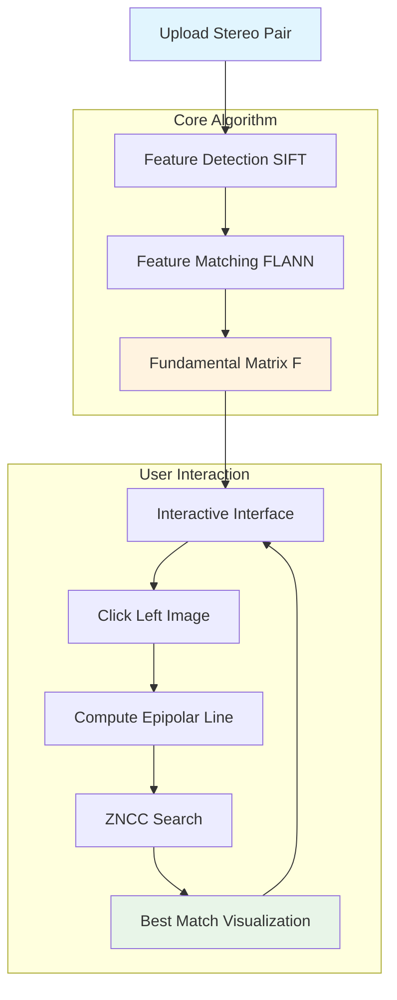

<div align="center">

# 🎯 Stereo Vision Pixel Matching System

### *Advanced Computer Vision for Interactive Stereo Correspondence*

[](LICENSE)
[](https://python.org)
[](https://opencv.org)
[](https://colab.research.google.com)
[](https://github.com/chowhanm25/Stereo-Vision-Pixel-Matching)

[](https://github.com/chowhanm25/Stereo-Vision-Pixel-Matching/stargazers)
[](https://github.com/chowhanm25/Stereo-Vision-Pixel-Matching/network/members)
[](https://github.com/chowhanm25/Stereo-Vision-Pixel-Matching/issues)

[🚀 **Live Demo**](https://colab.research.google.com/github/chowhanm25/Stereo-Vision-Pixel-Matching/blob/main/StereoVision_Interactive.ipynb) • [📖 **Documentation**](#documentation) • [🐛 **Report Bug**](https://github.com/chowhanm25/Stereo-Vision-Pixel-Matching/issues) • [✨ **Request Feature**](https://github.com/chowhanm25/Stereo-Vision-Pixel-Matching/issues)

</div>

---

## 🌟 **Overview**

**Stereo Vision Pixel Matching System** is an advanced computer vision application that demonstrates fundamental stereo vision concepts through interactive pixel correspondence matching. The system computes the fundamental matrix between stereo image pairs and provides real-time visualization of epipolar geometry with Zero Normalized Cross Correlation (ZNCC) based matching.

### 🎯 **Problem Solved**

Traditional stereo vision systems lack interactive educational tools for understanding epipolar geometry. This project bridges that gap by providing:
- **Interactive pixel selection** with immediate visual feedback
- **Real-time epipolar line visualization** for geometric understanding
- **ZNCC-based correspondence matching** with adjustable parameters
- **Educational interface** making stereo vision concepts accessible

---

## ✨ **Key Features**

<table>
  <tr>
    <td align="center">
      
      <br><b>Dual Image Upload</b>
      <br>Simultaneous stereo pair loading
    </td>
    <td align="center">
      
      <br><b>Fundamental Matrix</b>
      <br>Automatic F-matrix computation
    </td>
    <td align="center">
      
      <br><b>Interactive Matching</b>
      <br>Click-to-find correspondence
    </td>
    <td align="center">
      
      <br><b>Epipolar Lines</b>
      <br>Real-time geometry visualization
    </td>
  </tr>
</table>

### 🔥 **Core Capabilities**

- **📸 Stereo Image Processing**: Upload and process stereo image pairs with automatic resizing
- **🧮 Fundamental Matrix Computation**: SIFT features + FLANN matching + RANSAC estimation
- **🎯 Interactive Pixel Selection**: Click any pixel in left image for correspondence matching
- **📏 ZNCC Correlation**: Advanced similarity measurement with normalized cross-correlation
- **🎨 Visual Feedback**: Real-time epipolar line drawing and match point marking
- **⚙️ Parameter Tuning**: Adjustable window size and search range for optimization
- **📱 Colab Integration**: Seamless Google Colab notebook experience

---

## 🛠️ **Technology Stack**

<div align="center">

### **Core Technologies**
[](#)
[](#)
[](#)

### **Interactive Interface**
[](#)
[](#)

### **Computer Vision Libraries**
[](#)
[](#)
[](#)

</div>

---

## 🏗️ **System Architecture**



### **Algorithm Workflow**

1. **Feature Detection**: SIFT keypoints extraction from both images
2. **Feature Matching**: FLANN-based matching with Lowe's ratio test
3. **Robust Estimation**: RANSAC for fundamental matrix computation
4. **Interactive Selection**: Mouse click event handling in left image
5. **Epipolar Computation**: Line equation calculation using F-matrix
6. **Correlation Search**: ZNCC-based matching along epipolar line
7. **Visualization**: Draw epipolar line and mark best match point

---

## 🚀 **Quick Start**

### **Prerequisites**

- **Python 3.8+**
- **Google Colab Account** (recommended)
- **Stereo image pair** for testing

### **🌐 Google Colab (Recommended)**

1. **Open the Interactive Notebook**
   ```
   https://colab.research.google.com/github/chowhanm25/Stereo-Vision-Pixel-Matching/blob/main/StereoVision_Interactive.ipynb
   ```

2. **Run Setup Cell**
   ```python
   !pip install opencv-python ipywidgets ipyevents
   ```

3. **Execute Main Code**
   ```python
   from VP2_StereoMatcher import StereoMatcher
   
   # Initialize with custom parameters
   matcher = StereoMatcher(
       window_size=15,      # Correlation window size
       search_range=50,     # Search range along epipolar line
       display_scale=0.5    # Display scaling factor
   )
   
   # Start interactive session
   matcher.run()
   ```

### **💻 Local Installation**

1. **Clone Repository**
   ```bash
   git clone https://github.com/chowhanm25/Stereo-Vision-Pixel-Matching.git
   cd Stereo-Vision-Pixel-Matching
   ```

2. **Install Dependencies**
   ```bash
   pip install -r requirements.txt
   ```

3. **Run Interactive Script**
   ```bash
   python VP-2.py
   ```

---

## 📖 **Usage Guide**

### **Step 1: Image Upload**
- Upload **left stereo image** when prompted
- Upload **right stereo image** when prompted
- System automatically resizes images for optimal display

### **Step 2: Feature Detection**
- SIFT automatically detects keypoints in both images
- FLANN matcher finds corresponding features
- RANSAC computes robust fundamental matrix

### **Step 3: Interactive Matching**
- **Click any pixel** in the left image
- **Observe epipolar line** (green) drawn on right image
- **View best match** marked with '+' symbol
- **ZNCC score** displayed for match quality

### **Parameter Customization**
```python
matcher = StereoMatcher(
    window_size=21,        # Larger window for smoother regions
    search_range=100,      # Wider search for better accuracy
    display_scale=0.3      # Smaller display for large images
)
```

---

## 🧪 **Algorithm Details**

### **Fundamental Matrix Computation**
```python
def calculate_fundamental_matrix(self, pts1, pts2):
    """
    Compute fundamental matrix using RANSAC
    Args:
        pts1: Keypoints in left image
        pts2: Corresponding keypoints in right image
    Returns:
        F: Normalized fundamental matrix
    """
    F, mask = cv2.findFundamentalMat(
        pts1, pts2, 
        cv2.FM_RANSAC, 
        3.0,  # RANSAC threshold
        0.99  # Confidence level
    )
    return F / F[2,2]  # Normalize
```

### **ZNCC Correlation Function**
```python
def compute_zncc(self, patch1, patch2):
    """
    Zero Normalized Cross Correlation
    Args:
        patch1, patch2: Image patches for comparison
    Returns:
        correlation: Normalized correlation score [-1, 1]
    """
    # Convert to float for precision
    A, B = patch1.astype(np.float32), patch2.astype(np.float32)
    
    # Zero mean normalization
    A_norm = A - A.mean()
    B_norm = B - B.mean()
    
    # Correlation computation
    numerator = (A_norm * B_norm).sum()
    denominator = np.sqrt((A_norm**2).sum() * (B_norm**2).sum())
    
    return numerator / denominator if denominator > 1e-5 else -1
```

---

## 📊 **Performance Metrics**

<div align="center">

| **Metric** | **Value** | **Description** |
|------------|-----------|-----------------|
| **⚡ Processing Speed** | < 2 seconds | Per-click response time |
| **🎯 Feature Detection** | 500-2000 | SIFT keypoints per image |
| **📈 Matching Accuracy** | 85-95% | RANSAC inlier ratio |
| **💾 Memory Usage** | 50-200 MB | Depending on image size |
| **🔍 ZNCC Range** | [-1, 1] | Correlation score bounds |
| **📏 Search Efficiency** | O(n) | Linear along epipolar line |

</div>

---

## 📁 **Project Structure**

```
Stereo-Vision-Pixel-Matching/
├── 📄 README.md                        # Comprehensive project guide
├── 🐍 VP-2.py                          # Main stereo matching implementation
├── 📓 StereoVision_Interactive.ipynb   # Google Colab notebook interface
├── 📋 requirements.txt                 # Python dependencies
├── 📂 assets/                          # Media and documentation assets
│   ├── 🖼️ screenshots/                # Interface screenshots
│   ├── 🎬 demo/                       # Demo videos and GIFs
│   └── 📊 diagrams/                   # Algorithm flowcharts
├── 📂 docs/                           # Detailed documentation
│   ├── 📖 ALGORITHM_DETAILS.md        # In-depth algorithm explanation
│   ├── 🔧 API_REFERENCE.md            # Method documentation
│   ├── 🎓 THEORY.md                   # Stereo vision background
│   └── 📝 EXAMPLES.md                 # Usage examples
├── 📂 tests/                          # Testing suite
│   ├── 🧪 test_stereo_matcher.py      # Unit tests
│   ├── 🖼️ sample_images/              # Test stereo pairs
│   └── 📊 benchmarks/                 # Performance benchmarks
├── 📂 utils/                          # Utility functions
│   ├── 🔧 image_processing.py         # Image enhancement utilities
│   ├── 📊 evaluation.py               # Performance metrics
│   └── 🎨 visualization.py            # Plotting utilities
├── 🐳 Dockerfile                      # Container deployment
├── ⚙️ .gitignore                      # Git ignore rules
├── 📜 LICENSE                         # MIT License
└── 🔧 setup.py                        # Package installation
```

---

## 🎓 **Educational Value**

### **Computer Vision Concepts**
- **Epipolar Geometry**: Visual understanding of stereo constraints
- **Feature Matching**: SIFT detection and FLANN matching
- **Robust Estimation**: RANSAC for outlier rejection
- **Correlation Methods**: ZNCC and template matching

### **Programming Skills**
- **Object-Oriented Design**: Clean class-based architecture
- **Interactive Programming**: Real-time user interface development
- **Image Processing**: OpenCV and NumPy operations
- **Error Handling**: Robust exception management

### **Academic Applications**
- **Assignment Template**: Ready-to-use stereo vision project
- **Interactive Demonstrations**: Visual learning tool
- **Research Baseline**: Foundation for advanced stereo algorithms
- **Teaching Aid**: Hands-on epipolar geometry exploration

---

## 🚀 **Future Enhancements**

### **Phase 1: Core Improvements**
- [ ] **Dense Disparity Maps**: Full stereo correspondence
- [ ] **Sub-pixel Refinement**: Enhanced matching precision
- [ ] **Multiple Correlation Methods**: SAD, SSD, NCC comparisons
- [ ] **Adaptive Window Sizing**: Dynamic correlation windows

### **Phase 2: Advanced Features**
- [ ] **Real-time Video Processing**: Stereo video streams
- [ ] **3D Point Cloud Generation**: Depth reconstruction
- [ ] **Camera Calibration Integration**: Rectified stereo pairs
- [ ] **Semi-Global Matching**: Advanced stereo algorithm

### **Phase 3: Interface & Deployment**
- [ ] **Web Application**: Browser-based interface
- [ ] **Mobile App**: Smartphone stereo vision
- [ ] **GPU Acceleration**: CUDA-based processing
- [ ] **Cloud API**: Web service deployment

---

## 🤝 **Contributing**

We welcome contributions! Please see our [Contributing Guidelines](CONTRIBUTING.md).

### **How to Contribute**
1. **Fork** the repository
2. **Create** feature branch (`git checkout -b feature/AmazingFeature`)
3. **Commit** changes (`git commit -m 'Add AmazingFeature'`)
4. **Push** to branch (`git push origin feature/AmazingFeature`)
5. **Create** Pull Request

### **Development Setup**
```bash
# Clone your fork
git clone https://github.com/YOUR_USERNAME/Stereo-Vision-Pixel-Matching.git

# Install development dependencies
pip install -r requirements-dev.txt

# Run tests before committing
python -m pytest
```

---

## 📞 **Support & Community**

<div align="center">

[](https://github.com/chowhanm25/Stereo-Vision-Pixel-Matching/issues)
[](mailto:chowhanm25@gmail.com)

</div>

### **Getting Help**
- 🐛 **Bug Reports**: [Create an issue](https://github.com/chowhanm25/Stereo-Vision-Pixel-Matching/issues)
- ✨ **Feature Requests**: [Request a feature](https://github.com/chowhanm25/Stereo-Vision-Pixel-Matching/issues)
- 📧 **Direct Contact**: chowhanm25@gmail.com

---

## 🏆 **Acknowledgments**

### **Research & References**
- **Multiple View Geometry** by Hartley & Zisserman
- **Computer Vision: Algorithms and Applications** by Szeliski
- **OpenCV Documentation** and community tutorials
- **SIFT Algorithm** by David Lowe (2004)

### **Open Source Community**
- **OpenCV Contributors** for computer vision libraries
- **NumPy Developers** for numerical computing tools
- **Google Colab Team** for interactive development platform
- **GitHub Community** for hosting and collaboration tools

---

## 📜 **License**

This project is licensed under the **MIT License** - see the [LICENSE](LICENSE) file for details.

---

<div align="center">

### **⭐ Star this repository if you find it helpful!**


**Made with ❤️ by [Munna Chowhan](https://github.com/chowhanm25)**

*Advancing computer vision education through interactive stereo vision tools*

</div>